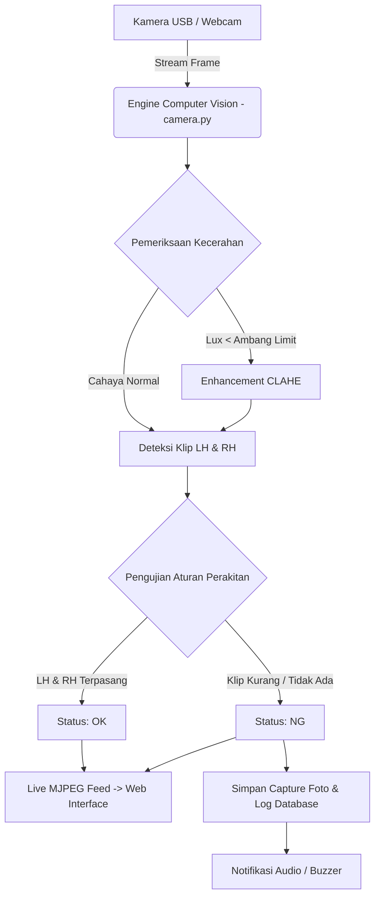

# 👁️🏭 Ikuyo Vision System — System Deteksi & Pemantauan Perakitan Child Part

[](https://www.python.org/)
[](https://flask.palletsprojects.org/)
[](https://opencv.org/)
[](https://www.sqlite.org/)

**Ikuyo Vision System** adalah sistem *Quality Control* (QC) dan pemantauan perakitan komponen kecil (*child part assembly*) berbasis **Computer Vision** dan **Machine Learning** yang dirancang khusus untuk industri manufaktur (seperti PT Ikuyo Indonesia). 

Sistem ini memonitor proses perakitan komponen klip secara *real-time* di garis produksi untuk memastikan seluruh klip (*LH/Kiri* dan *RH/Kanan*) terpasang dengan lengkap sebelum produk dinyatakan **OK**, sehingga mencegah produk cacat (**NG**) lolos ke konsumen.

---

## 📋 Daftar Isi

1. [🎯 Fitur Utama](#-fitur-utama)
2. [📐 Arsitektur Sistem & Alur Kerja](#-arsitektur-sistem--alur-kerja)
3. [💻 Spesifikasi & Teknologi](#-spesifikasi--teknologi)
4. [📂 Struktur Folder & Berkas Proyek](#-struktur-folder--berkas-proyek)
5. [🔑 Akun Bawaan (Default Credentials)](#-akun-bawaan-default-credentials)
6. [🚀 Panduan Instalasi & Menjalankan Aplikasi](#-panduan-instalasi--menjalankan-aplikasi)
7. [📖 Panduan Penggunaan Berdasarkan Peran (Role)](#-panduan-penggunaan-berdasarkan-peran-role)
8. [⚙️ Panduan Konfigurasi Sistem (Settings)](#%EF%B8%8F-panduan-konfigurasi-sistem-settings)
9. [🛠️ Troubleshooting & Penanganan Error](#%EF%B8%8F-troubleshooting--penanganan-error)

---

## 🎯 Fitur Utama

### 1. 🎥 Real-Time Inspection & Live Camera Streaming
* **Multi-Step Metal Detection**: Algoritma OpenCV presisi tinggi mendeteksi Klip LH (*Kiri*) dan Klip RH (*Kanan*) menggunakan segmentasi warna HSV, ekstraksi kontur logam, dan filter anti-kulit (*anti-skin mask*).
* **Anti-Flicker Voting Stabilization**: Menggunakan algoritma *history voting* (5-frame buffer) untuk mencegah kedipan (*flicker*) status saat pemantauan.
* **Optimalisasi Cahaya Rendah (CLAHE)**: Fitur *Contrast Limited Adaptive Histogram Equalization* otomatis aktif jika tingkat kecerahan ruangan berada di bawah ambang batas (Lux Level).
* **Audio Feedback (Buzzer)**: Memberikan efek suara indikasi ketika mendeteksi status **NG** (atau **OK** jika diaktifkan).
* **Penyimpanan Log Otomatis**: Hasil inspeksi disimpan ke database SQLite lengkap dengan foto tangkapan (*raw image snapshot*), skor keyakinan (*confidence*), dan ID operator.

### 2. 📊 Dashboard Analitik Real-Time
* Metrik langsung: Total Inspeksi, Jumlah OK, Jumlah NG, Defect Rate (%), Rata-Rata Akurasi AI (%), dan Cycle Time.
* **Grafik Distribusi NG Per Jam**: Visualisasi grafik jam produksi untuk memantau waktu puncak ditemukannya produk cacat (*fatigue analytics*).
* **Tabel Aktivitas Terbaru**: Menampilkan log inspeksi secara langsung (*live update*).

### 3. 👥 Manajemen Pengguna Berbasis Peran (RBAC)
Sistem memiliki 3 tingkat hak akses pengguna:
* **Admin**: Akses penuh ke seluruh fitur, manajemen pengguna, konfigurasi AI/Kamera, pengubahan branding (nama/logo), dan evaluasi akurasi.
* **Quality Control (QC)**: Akses ke dashboard analitik, laporan riwayat inspeksi, analisa hasil, dan ekspor data CSV.
* **Operator**: Berfokus pada layar inspeksi kamera langsung (*Live Camera View*) saat bertugas di lini produksi.

### 4. 📝 Laporan Inspeksi & Ekspor Data (CSV)
* Pencarian dan filter log inspeksi berdasarkan rentang tanggal, status (OK/NG), dan operator.
* Ekspor laporan ke format **CSV** untuk analisis lebih lanjut di Excel/Spreadsheet.
* Modal preview foto tangkapan inspeksi produk.

### 5. 🔬 Evaluasi Akurasi & Analisa Hasil
* **Evaluasi Sistem AI**: Halaman khusus untuk menghitung akurasi, presisi, dan sensitivitas deteksi sistem.
* **Analisa Hasil Produksi**: Analisis mendalam pola kegagalan perakitan.

### 6. ⚙️ Branding & Konfigurasi Dinamis
* Mengubah nama aplikasi, logo, dan favicon secara dinamis langsung dari antarmuka tanpa menyentuh kode program.
* Konfigurasi source kamera (Webcam Index 0, 1, dst.), batas ambang *Confidence*, target jumlah klip, dan jeda *logging*.

---

## 📐 Arsitektur Sistem & Alur Kerja



---

## 💻 Spesifikasi & Teknologi

| Komponen | Teknologi | Keterangan |
| :--- | :--- | :--- |
| **Bahasa Pemrograman** | Python 3.10.x | Diuji dan berjalan optimal pada Laragon Python 3.10 |
| **Web Framework** | Flask 3.0.0 | Router web server & REST API |
| **Authentication** | Flask-Login 0.6.3 | Manajemen sesi pengguna & proteksi route |
| **Computer Vision** | OpenCV (`opencv-python` 4.8.1) | Pengolahan citra, filter HSV, CLAHE, contour analysis |
| **Visi AI Model** | YOLOv5 (`yolov5s.onnx`) | Integrasi model ONNX via OpenCV DNN |
| **Database** | SQLite3 (`database.db`) | Penyimpanan log inspeksi, user, profil setting & aktivitas |
| **Frontend UI** | HTML5, Jinja2, TailwindCSS, Chart.js, FontAwesome | Desain dashboard responsif & modern |

---

## 📂 Struktur Folder & Berkas Proyek

```text
c:/laragon/www/deteksi/
│
├── app.py                   # Server utama Flask (Route Web, Controller, & Autentikasi)
├── camera.py                # Engine Computer Vision, Deteksi Klip, & Stabilisasi Image
├── database.py              # Skema SQLite3, Pengaturan Default, & Fungsi Log
├── requirements.txt         # Daftar paket/library Python yang dibutuhkan
├── run.bat                  # Script Windows Batch untuk menjalankan aplikasi dengan cepat
├── yolov5s.onnx             # Model AI YOLOv5 format ONNX
├── dataset.json             # Pemetaan kelas deteksi
├── database.db              # File SQLite database (terbuat otomatis saat app pertama berjalan)
│
├── static/                  # File aset statis
│   ├── css/                 # File styling kustom
│   ├── js/                  # File Javascript interaktif
│   ├── uploads/             # Direktori penyimpanan foto profil, logo, dan capture inspeksi
│   │   ├── profiles/        # Foto profil pengguna
│   │   └── snapshots/       # Foto hasil inspeksi produk NG
│   └── favicon.ico          # Favicon website
│
└── templates/               # Berkas tampilan HTML (Jinja2 Template Engine)
    ├── base.html            # Layout utama (Navbar, Sidebar, Footer, Layout Wrapper)
    ├── login.html           # Halaman Form Login pengguna
    ├── dashboard.html       # Halaman Dashboard Analitik Utama
    ├── camera.html          # Halaman Inspeksi Kamera Live untuk Operator
    ├── reports.html         # Halaman Laporan & Riwayat Inspeksi (OK/NG)
    ├── analisa_hasil.html   # Halaman Analisis Statistik Hasil Inspeksi
    ├── evaluation.html      # Halaman Evaluasi Akurasi Sistem AI
    ├── users.html           # Halaman Manajemen User (Tambah/Edit/Hapus User)
    ├── settings.html        # Halaman Pengaturan Sistem & Branding App
    ├── database_settings.html # Halaman Konfigurasi Database & Backup
    ├── activity_logs.html   # Halaman Catatan Log Aktivitas Pengguna
    └── index.html           # Halaman pengalihan awal (Redirector)
```

---

## 🔑 Akun Bawaan (Default Credentials)

Saat pertama kali dijalankan, `database.py` akan secara otomatis membuat *database* dan mengisikan akun default berikut:

| Role (Peran) | Username | Password | Akses & Wewenang |
| :--- | :--- | :--- | :--- |
| **Admin** | `admin` | `admin123` | Akses penuh ke seluruh fitur & sistem |
| **QC (Quality Control)** | `qc` | `qc123` | Akses ke Dashboard, Laporan, Analitik, & Evaluasi |
| **Operator** | `operator` | `operator123` | Akses khusus Halaman Kamera Live Inspeksi |

> ⚠️ **Catatan Keamanan**: Disarankan untuk segera mengubah password default pengguna setelah berhasil masuk pertama kali.

---

## 🚀 Panduan Instalasi & Menjalankan Aplikasi

### Prasyarat Sistem
* Windows 10 / 11 (atau OS Linux/macOS).
* Python 3.10+ (Sudah terinstall bawaan di Laragon `C:\laragon\bin\python\python-3.10\python.exe`).
* Web Camera (USB Webcam terhubung ke PC/Laptop).

---

### Cara 1: Menggunakan Script `run.bat` (Paling Mudah)

1. Buka folder proyek `C:\laragon\www\deteksi`.
2. Klik ganda (*double-click*) pada berkas **`run.bat`**.
3. Buka browser (Google Chrome / Edge) dan akses URL:
   👉 **`http://127.0.0.1:5000`**

---

### Cara 2: Menjalankan Manual via Terminal (Command Prompt / PowerShell)

1. Buka terminal (CMD / PowerShell).
2. Navigasikan ke direktori proyek:
   ```cmd
   cd C:\laragon\www\deteksi
   ```
3. Jalankan aplikasi menggunakan Python Laragon 3.10:
   ```cmd
   C:\laragon\bin\python\python-3.10\python.exe app.py
   ```
4. Buka browser dan akses:
   👉 **`http://127.0.0.1:5000`**

---

## 📖 Panduan Penggunaan Berdasarkan Peran (Role)

### 1. 🧑‍🏭 Panduan Operator (Lini Produksi)
1. Login menggunakan akun `operator`.
2. Sistem otomatis mengarahkan ke halaman **Kamera Live** (`/camera`).
3. Tempatkan komponen perakitan di area jangkauan kamera.
4. Perhatikan indikator di layar:
   * 🟢 **OK (HIJAU)**: Klip Kiri (LH) dan Klip Kanan (RH) terdeteksi lengkap.
   * 🔴 **NG (MERAH)**: Klip kurang atau tidak terdeteksi. Sistem akan berbunyi dan merekam gambar ke laporan.
   * 🟡 **STANDBY (KUNING)**: Menunggu objek masuk ke area inspeksi.

### 2. 🕵️‍♂️ Panduan QC (Quality Control)
1. Login menggunakan akun `qc`.
2. Akses menu **Dashboard** untuk melihat statistik OK vs NG harian dan defect rate.
3. Akses menu **Laporan Inspeksi** untuk memfilter data inspeksi, melihat foto produk yang mengalami NG, atau mengunduh data dalam bentuk file CSV (`Export CSV`).
4. Akses menu **Analisa Hasil** dan **Evaluasi Akurasi** untuk memantau performa deteksi AI.

### 3. 🛠️ Panduan Admin
1. Login menggunakan akun `admin`.
2. **Manajemen User**: Tambahkan operator baru, ubah foto profil, atau perbarui role pengguna pada menu `Pengguna`.
3. **Pengaturan Sistem**: 
   * Pilih index sumber kamera (`Camera Source`).
   * Atur target klip LH/RH.
   * Sesuaikan ambang batas AI (*Confidence Threshold*).
   * Ganti nama aplikasi dan unggah logo perusahaan baru.

---

## ⚙️ Panduan Konfigurasi Sistem (Settings)

Halaman Pengaturan (`/settings`) memungkinkan Admin mengatur parameter operasi berikut:

* **Camera Source**: Urutan indeks webcam (0 = Webcam Internal, 1 = USB Webcam Eksternal).
* **Target Klip LH / RH**: Jumlah minimal klip yang harus terdeteksi di setiap sisi (default: 1).
* **Lux Level (Low Light Limit)**: Batas kecerahan cahaya di mana algoritma CLAHE penjelas gambar akan aktif secara otomatis.
* **AI Confidence Threshold**: Ambang keyakinan minimum deteksi (skala 0.0 - 1.0). Default: `0.40`.
* **Jeda Logging (Detik)**: Delay interval antar perekaman produk NG ke database agar terhindar dari duplikasi data berlebih (default: 5 detik).
* **Buzzer Notification**: Mengaktifkan/mematikan bunyi peringatan suara saat status NG / OK.

---

## 🛠️ Troubleshooting & Penanganan Error

### 1. Error: `ModuleNotFoundError: No module named 'flask'`
* **Penyebab**: Perintah `python` di terminal mengeksekusi virtual environment bawaan lain (seperti `hermes-agent`) yang tidak memiliki library Flask.
* **Solusi**: 
  Jalankan aplikasi menggunakan path lengkap Python Laragon:
  ```cmd
  C:\laragon\bin\python\python-3.10\python.exe app.py
  ```
  atau jalankan lewat script [run.bat](file:///c:/laragon/www/deteksi/run.bat).

### 2. Kamera Tidak Muncul / Layar Hitam di Halaman Inspeksi
* **Penyebab**: Indeks kamera salah atau webcam sedang digunakan oleh aplikasi lain (seperti Zoom, Teams, Camera App).
* **Solusi**:
  1. Tutup semua aplikasi lain yang menggunakan webcam.
  2. Buka menu **Pengaturan** (`/settings`) dengan akun Admin.
  3. Ubah **Camera Source** dari `0` menjadi `1` (atau sebaliknya), lalu simpan pengaturan.

### 3. Database Cepat Penuh / Lambat
* **Solusi**: Masuk ke menu **Database Settings** (`/database_settings`) untuk melakukan pembersihan log lama (*clean up log*) atau melakukan pencadangan database (*backup database*).

---

*Dikembangkan untuk meningkatkan efisiensi dan standar kualitas manufaktur industri secara presisi.* 🤖🚀
